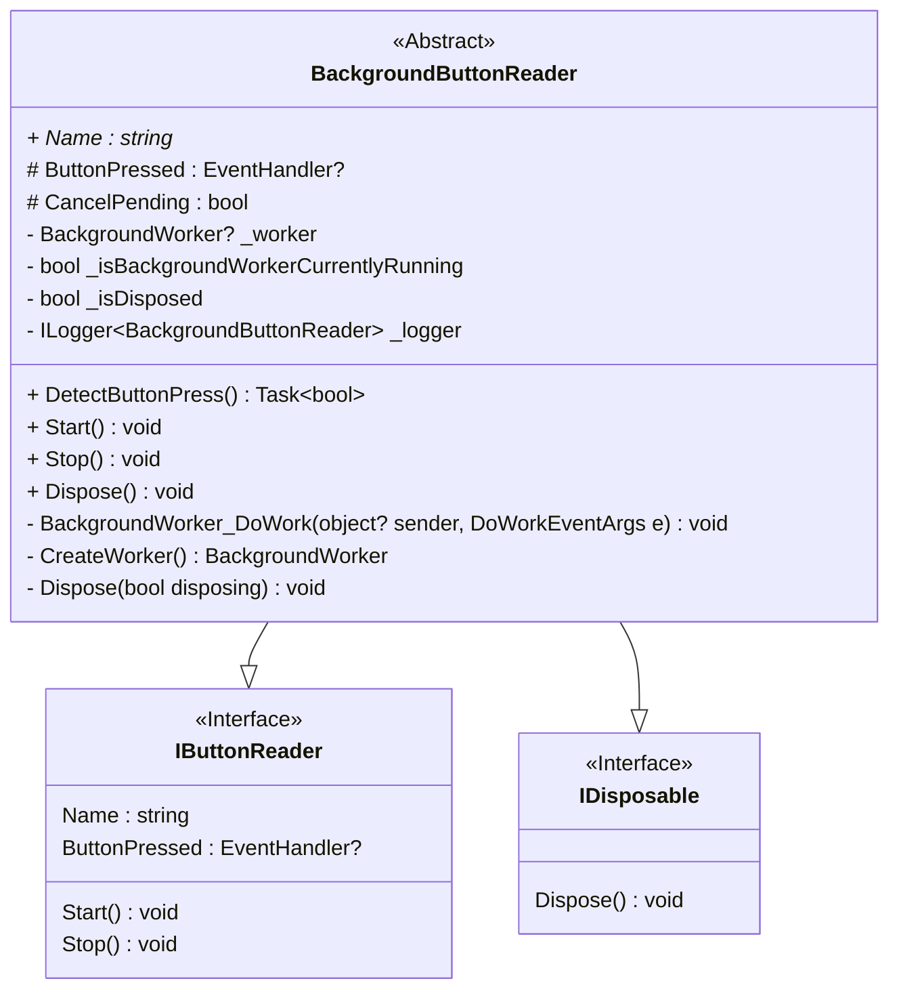
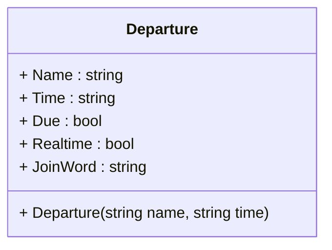
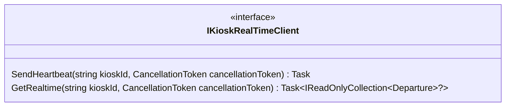
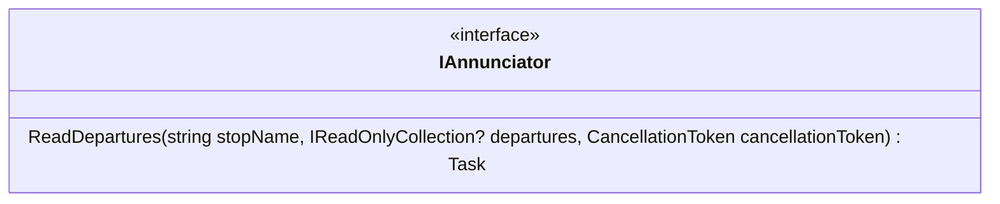

# Mtd.Kiosk.Annunciator

## Mtd.Kiosk.Annunciator.Core

The service uses implementations of the `IButtonReader` interface to detect button presses.
The `IButtonReader` defines a `Start()` and `Stop()` method and an event handler for when a button is pressed.

`BackgroundButtonReader` is an abstract implementation of `IButtonReader` that
uses a `BackgroundWorker` execute the code that detects button presses in the background.

Implementations if `IButtonReader` that wish to inherit from `BackgroundButtonReader`
should implement their detection code in the `DetectButtonPress()` method.
This method should return true when the button is pressed.
The `BackgroundButtonReader` will raise the `ButtonPressed` event when the button is pressed and
call `DetectButtonPress()` in a loop until the `CancelPending` property is set to true.

Implementations of `IButtonReader` are consumed byt the `Mtd.Kiosk.Annunciator.Service.AnnunciatorService`
class for the purpose of detecting button presses.

The `Departure` object is a simple DTO that represents a departure from a stop.
The `Departure` DTO is the return value for the `IKioskRealTimeClient.GetRealtime` method
and the parameter for the `IAnnunciator.ReadDepartures` method.

The `IKioskRealTimeClient` interface defines methods to interface with MTD servers for real-time data.
The SendHeartbeat method sends a heartbeat to the server for backend reporting on the service's health.
An implementation of `IKioskRealTimeClient` is consumed by the `Mtd.Kiosk.Annunciator.Service.AnnunciatorService` class
for the purpose of fetching departures when the button is pressed.

The `IAnnunciator` interface defines a method to read departures.
An implementation of `IAnnunciator` is consumed by the `Mtd.Kiosk.Annunciator.Service.AnnunciatorService` class
for the purpose of reading departures aloud.

