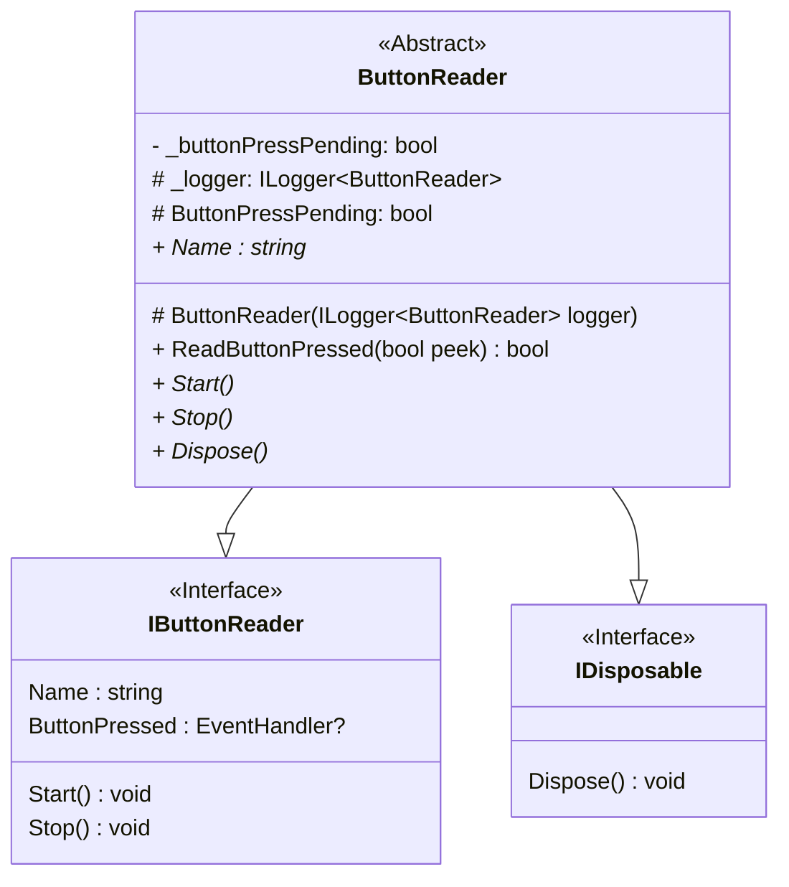
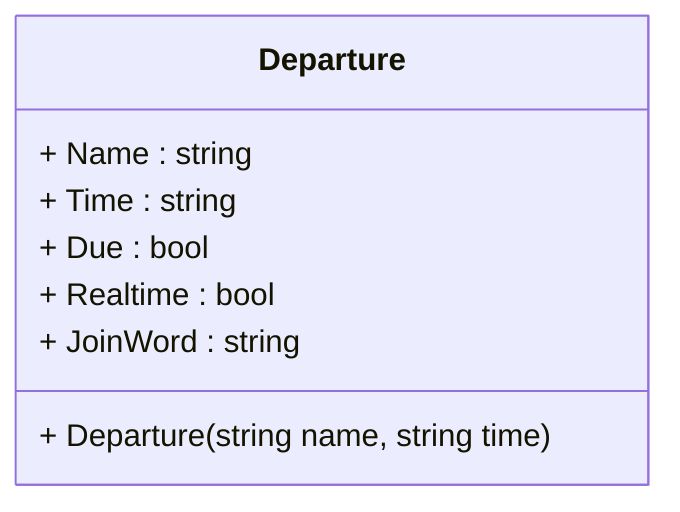
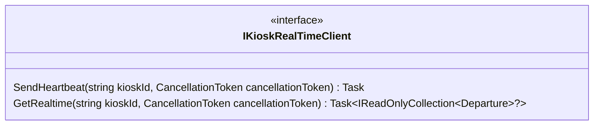
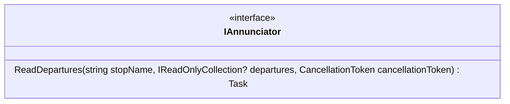
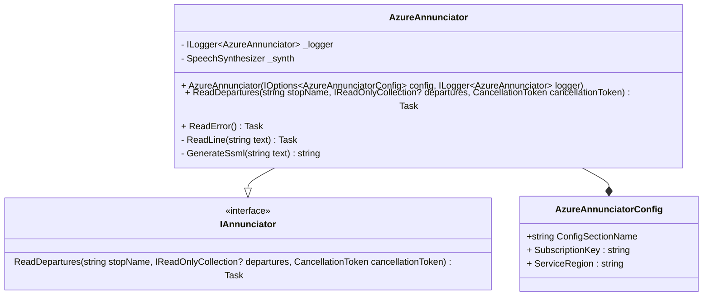
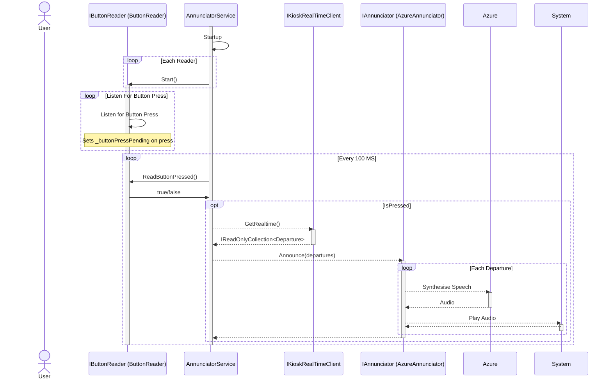

# Mtd.Kiosk.Annunciator
[](https://github.com/CUMTD/Mtd.Kiosk.Annunciator/actions/workflows/build-test.yml)
[](https://github.com/CUMTD/Mtd.Kiosk.Annunciator/actions/workflows/codeql.yml)

This project contains the code for departure annunciation on MTD's StopWatch Kiosks.
The service listens for button presses and, when a button is pressed, reads upcoming departures aloud.

## Technologies

* [.NET 8][net8]
* [Azure Cognitive Services][speech-docs] - For Performing Text-to-Speech
* [Serilog][serilog] - For Structured Logging
* [SEQ][seq] - For Log Aggregation

## Projects

### Mtd.Kiosk.Annunciator.Core

This project contains core, and generic code for the kiosk annunciator service.

The service uses implementations of the `IButtonReader` interface to detect button presses.
The `IButtonReader` defines a `Start()` and `Stop()` method and a `ReadButtonPressed` method for when
a button is pressed.

Implementations if `IButtonReader` that wish to inherit from `ButtonReader`
should implement their detection code in the to set the `_buttonPressPending` property to true
when a press is detected.

Implementations of `IButtonReader` are consumed byt the `Mtd.Kiosk.Annunciator.Service.AnnunciatorService`
class for the purpose of detecting button presses.



The `Departure` object is a simple DTO that represents a departure from a stop.
The `Departure` DTO is the return value for the `IKioskRealTimeClient.GetRealtime` method
and the parameter for the `IAnnunciator.ReadDepartures` method.



The `IKioskRealTimeClient` interface defines methods to interface with MTD servers for real-time data.
The SendHeartbeat method sends a heartbeat to the server for backend reporting on the service's health.
An implementation of `IKioskRealTimeClient` is consumed by the `Mtd.Kiosk.Annunciator.Service.AnnunciatorService` class
for the purpose of fetching departures when the button is pressed.



The `IAnnunciator` interface defines a method to read departures.
An implementation of `IAnnunciator` is consumed by the `Mtd.Kiosk.Annunciator.Service.AnnunciatorService` class
for the purpose of reading departures aloud.



### Mtd.Kiosk.Annunciator.Azure

This project contains code that interfaces with Azure's Text-to-Speech service to read departures aloud.

`Mtd.Kiosk.Annunciator.Azure` is an implementation of `IAnnunciator` that reads departures aloud using Azure's Text-to-Speech service.
The Azure text-to-speech service is a part of the [`Microsoft.CognitiveServices.Speech`][nuget-speech] NuGet package.
More information on the Azure text-to-speech service can be found in the [official documentation][speech-docs].



### Mtd.Kiosk.Annunciator.Readers.Raspi

This project contains an implementation of `IButtonReader` that interfaces with the Raspberry Pi's GPIO pins.

### Mtd.Kiosk.Annunciator.Readers.Simple

This project contains simple implementations of the `IButtonReader` interface.
These are mostly meant for testing and example purposes.
This is a good place to start if building a new implementation.

### Mtd.Kiosk.Annunciator.Realtime.UmbracoApi

This project contains an implementation of `IKioskRealTimeClient` that interfaces with the
Umbraco API that powers the kiosk data.

### Mtd.Kiosk.Annunciator.Service

This project contains `Program.cs`, the entry point for the application.
It runs as either a Windows Service or as a Linux Daemon.
It configures the application and starts the `AnnunciatorService` class.
`AnnunciatorService` is a `BackgroundService` that listens for button presses,
fetches the latest departure information, and reads the departures aloud.

A simplified sequence diagram of the `AnnunciatorService` and the application flow is shown below.



In addition to listening for button presses, the applicaiton also sends heartbeats to the central server
on a periodic basis to report on the health of the service.

## Development

To load the project, you need to add the following values to a user-secrets file or as environment variables.

```json
{
  "AzureAnnunciator": {
    "SubscriptionKey": "Your Subscription ID",
    "ServiceRegion": "Your Region"
  },
  "Kiosk": {
    "Id": "The Kiosk GUID to Associate With",
    "Name": "Kiosk Name to Read"
  },
  "Serilog": {
    "WriteTo": [
    {
      "Name": "Seq",
      "Args": {
        "ServerUrl": "SEQ Server URL"
        "ApiKey": "SEQ API Key"
      }
      }
    ]
  }
}

```
### Linux example:
```bash
export Mtd_Kiosk_Annunciator_Service_AzureAnnunciator__SubscriptionKey="{subscription key}"
export Mtd_Kiosk_Annunciator_Service_AzureAnnunciator__ServiceRegion="eastus"
export Mtd_Kiosk_Annunciator_Service_Kiosk__Id="{kiosk id}"
export Mtd_Kiosk_Annunciator_Service_Kiosk__Name="{kiosk name}"
export Mtd_Kiosk_Annunciator_Service_Serilog__WriteTo__0__Name="Seq"
export Mtd_Kiosk_Annunciator_Service_Serilog__WriteTo__0__Args__ServerUrl="https://seq.mtd.org/"
export Mtd_Kiosk_Annunciator_Service_RealTimeClient__HeartbeatAddressTemplate="https://kiosk.mtd.org/umbraco/api/health/buttonheartbeat?id={0}"
export Mtd_Kiosk_Annunciator_Service_RealTimeClient__RealTimeAddressTemplate="https://kiosk.mtd.org//umbraco/api/realtime/getdepartures?id={0}&log=false"
export Mtd_Kiosk_Annunciator_Service_AzureAnnunciator__SpeakerOutputDevice="sysdefault:CARD=Headphones"
```

[nuget-speech]: https://www.nuget.org/packages/Microsoft.CognitiveServices.Speech
[speech-docs]: https://docs.microsoft.com/en-us/azure/cognitive-services/speech-service/overview
[net8]: https://learn.microsoft.com/en-us/dotnet/core/introduction
[serilog]: https://serilog.net/
[seq]: https://datalust.co/seq
